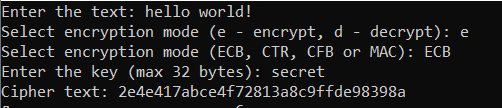
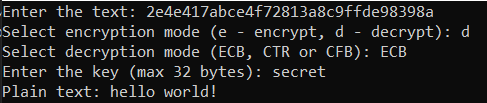

# GOST-28147-89
This is my old C++ project that allows you to encrypt and decrypt data using the GOST-28147-89 algorithm.
## Usage
Run the GOST-28147-89.exe file and enter the data following the prompts.
### Encryption

### Decryption

To work with data, one of three encryption / decryption modes (**ECB**, **CTR**, **CFB**), as well as a hash sum (**MAC**) can be used. [Details](https://ru.wikipedia.org/wiki/%D0%93%D0%9E%D0%A1%D0%A2_28147-89).

If you don't want to use the console utility or want to use the implementation of GOST-28147-89 in your program, then take the code from *GOST-28147-89.cpp*, everything except the *main* function will be useful to you.